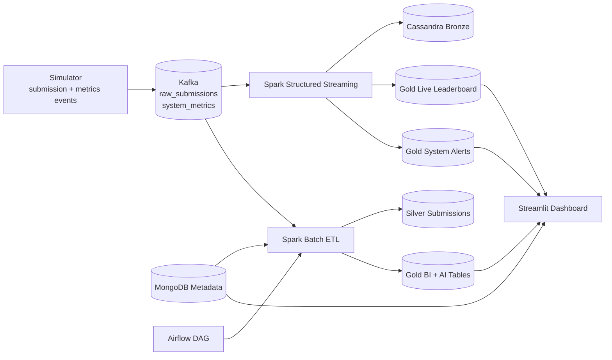

# 02 - System Architecture

## High-Level Flow

1. Simulator emits events to Kafka topics `raw_submissions` and `system_metrics`.
2. Spark Structured Streaming consumes both topics, then writes:
   - Bronze raw payload tables
   - Gold live leaderboard
   - Gold system alerts
3. Spark batch ETL reads Bronze, builds Silver, computes Gold BI and AI outputs.
4. Streamlit dashboard serves real-time and batch analytics.
5. Airflow orchestrates nightly batch execution.

## Diagram

## Architecture Style

- Lambda architecture:
  - Speed layer: streaming leaderboard and alerting
  - Batch layer: nightly model and BI refresh
- Medallion model in Cassandra:
  - Bronze: raw payload durability
  - Silver: cleaned telemetry
  - Gold: dashboard- and model-ready aggregates

## Service Topology

- Kafka + Zookeeper for ingestion
- Cassandra 3-node ring for distributed wide-column storage
- MongoDB 3-node replica set for metadata and business entities
- Airflow + Postgres for orchestration
- Streamlit for serving analytics

## Runtime Entry Points

- Simulator: `src/code_metrics/simulator/generate_logs.py`
- Streaming job: `src/code_metrics/processing/stream_leaderboard.py`
- Batch ETL: `src/code_metrics/processing/batch_etl.py`
- Dashboard: `src/code_metrics/dashboard/app.py`
- Orchestration: `airflow/dags/code_metrics_dag.py`

## Design Goals

- Absorb bursty telemetry through Kafka decoupling
- Keep stream alive under transient Cassandra/Kafka faults
- Maintain HA with Cassandra ring + Mongo replica set
- Provide both operational monitoring and strategic BI/AI outputs
