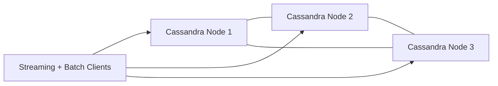
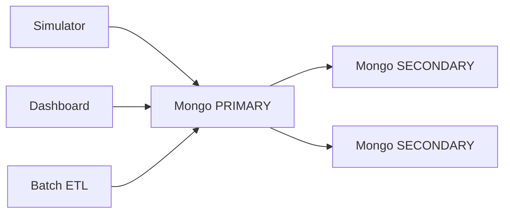

# 04 - Distributed and HA Design

## Cassandra Masterless Ring

### Topology

- 3 Cassandra nodes: `cassandra`, `cassandra2`, `cassandra3`
- Shared cluster name: `CodeMetricsCluster`
- Seed discovery through `CASSANDRA_SEEDS=cassandra`

### Why it is Masterless

- No single primary coordinator for data ownership.
- Any healthy node can coordinate requests.
- Data is replicated based on keyspace replication settings.



### Local Development Behavior

- Host-side clients connect through `127.0.0.1:9042`.
- Ring peers may advertise container network addresses.
- `CASSANDRA_ALLOWED_HOSTS` constrains client-side host usage to avoid peer-connection noise.

## MongoDB Primary-Secondary HA

### Replica Set

- Replica set ID: `rs0`
- Members:
  - `mongodb` with higher priority (candidate for PRIMARY)
  - `mongodb2` and `mongodb3` as SECONDARY members

### Initialization

`mongodb-rs-init` runs once after health checks and executes `rs.initiate(...)`.

### Benefits

- Automatic primary election
- Read scaling and failover support
- Consistent metadata service for simulator, batch enrichment, and dashboard



## Airflow Availability Strategy

- Uses Postgres backend with health checks
- Dedicated scheduler and webserver services
- Scheduler command runs inside restart loop for resilience

## Operational Verification

```bash
podman exec -i code-metrics-platform-cassandra-1 nodetool status
podman exec -i code-metrics-platform-mongodb-1 mongosh --quiet --eval "rs.status().members.map(m => ({name: m.name, state: m.stateStr, health: m.health}))"
```
